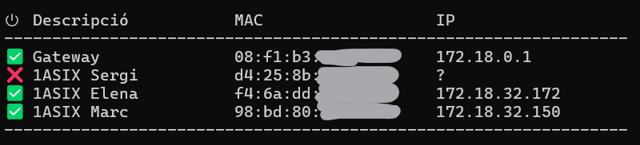

# Monitor de la xarxa
Script per monitoritzar els hosts d'una xarxa.

Dissenyat per a que l'alumnat pugui realitzar activitats **amb ordinador** però **sense connexió a Internet**.

Demanem a l'alumnat que es connecti a una xarxa wifi configurada sense accés a Internet. Amb aquest script monitoritzem que hi estiguin connectats.

## Instruccions

### Professor

1. Connectar-se a una xarxa wifi sense sortida a Internet.
2. Prendre nota de l'adreça IP.
3. Executar `python monitor.py`
4. Obrir el fitxer macs.txt per indicar el nom de cada alumne assignat a la seva adreça MAC.

### Alumnat

1. Connectar-se a una mateixa xarxa wifi que el professor (sense sortida a Internet).
2. Habilitar la resposta als pings del firewall, o deshabilitar-lo per complet.
3. Executar `ping -t ADREÇA_IP_PROFESSOR`

## Captures de pantalla

